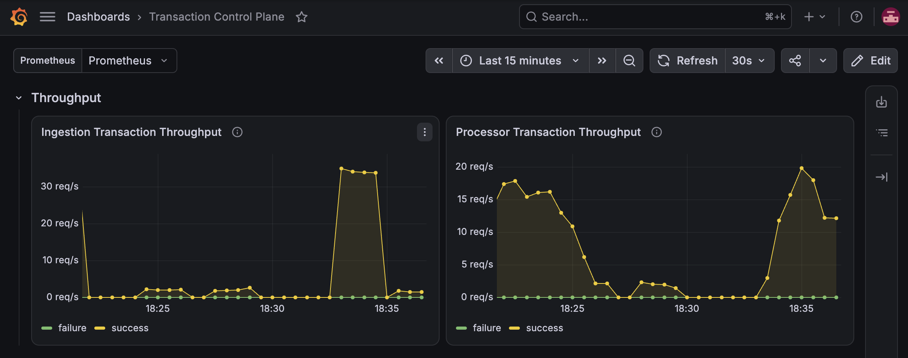
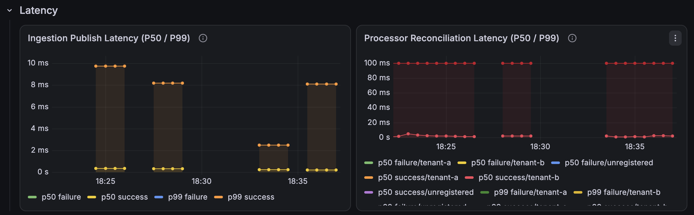
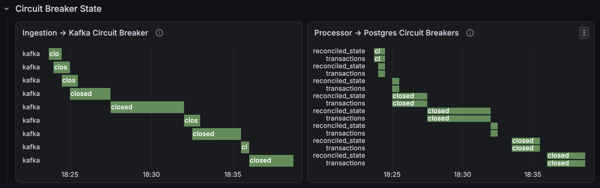
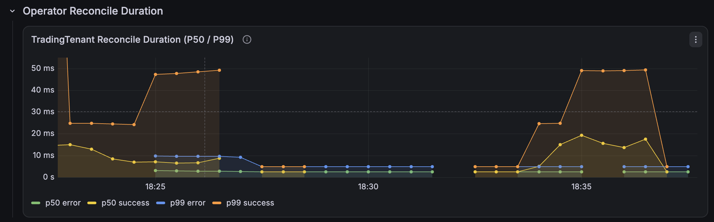
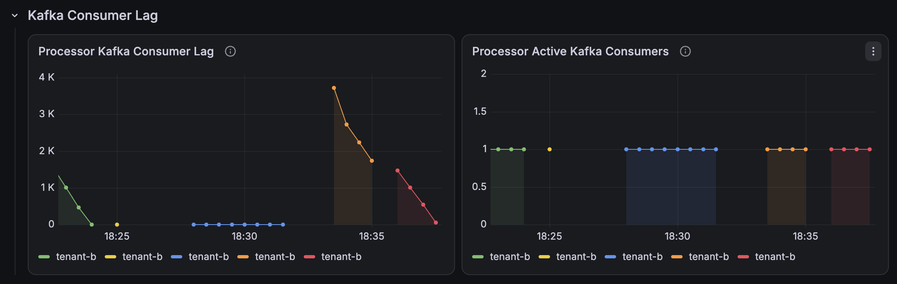
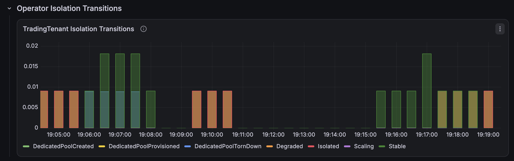
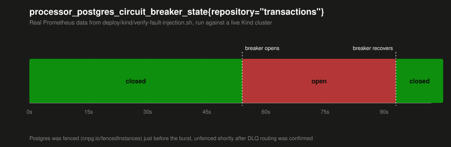

# go-transaction-control-plane

[](https://github.com/anwinsenp/go-transaction-control-plane/actions/workflows/ci.yml)

A distributed, real-time transaction processing engine in Go: a
zero-allocation ingestion hot path, Kafka-based event streaming, a
Postgres-backed reconciliation layer, a custom Kubernetes operator for
tenant-aware scaling, and Prometheus/Grafana telemetry.

**Status:** Complete. The full stack (Strimzi Kafka, CloudNativePG Postgres,
kube-prometheus-stack, ingestion, processor, and the TradingTenant operator)
deploys and runs end-to-end on a local Kind cluster — see
[Local development](#local-development) — and has been verified under load
and under fault injection (Postgres outage, DLQ routing), with a working
noisy-tenant isolation demo. See [Architecture](docs/ARCHITECTURE.md) for
the full design, [Load test results](#load-test-results) for numbers from a
real run (single client, single partition — see that section for what
changes at higher throughput), and
[Fault injection](#fault-injection) for the failure-path demo.

**Stack:** Go · Kafka (Strimzi) · PostgreSQL (self-hosted, in-cluster) ·
Kubernetes (`controller-runtime`) · Prometheus/Grafana · Kind (local dev)

## Documentation

| Doc | What's in it |
|---|---|
| [Architecture](docs/ARCHITECTURE.md) | System design, goals/non-goals, major trade-offs |
| [Ingestion design](docs/DESIGN-ingestion.md) | Zero-allocation hot-path strategy, gRPC/REST transport lifecycle, request validation, backpressure, circuit breaker around Kafka publish |
| [Ledger design](docs/DESIGN-ledger.md) | `internal/ledger` domain types, fixed-point `int64` amount representation and parsing, Postgres `BIGINT` schema |
| [Processor design](docs/DESIGN-processor.md) | Idempotent weighted-average-cost P&L reconciliation and the Kafka consumer's bounded-retry dead-letter-queue routing |
| [Operator design](docs/DESIGN-operator.md) | `TradingTenant` CRD spec and reconcile decision logic |
| [Operator alerts runbook](docs/RUNBOOK-operator-alerts.md) | Per-alert diagnosis and action steps for scaling, noisy-neighbor isolation, and downstream bottleneck alerts |
| [Architecture decisions](docs/decisions/) | Log of significant design decisions with rationale |

## Local development

Prerequisites: Docker, `kind`, `helm`, `kubectl` (on macOS: `brew install
kind helm`).

Bring up the full stack (Kafka, Postgres, Prometheus, ingestion, processor,
operator) on a local Kind cluster:

```
make kind-up      # creates the cluster and installs the TradingTenant CRDs
make kind-load    # builds ingestion/processor/operator images and loads
                   # them into the cluster (re-run after any code change)
make kind-deploy  # installs Strimzi/CloudNativePG/kube-prometheus-stack via
                   # Helm and applies the ingestion/processor/operator
                   # manifests, in dependency order
make kind-verify  # sends a sample transaction through the live stack and
                   # asserts (non-zero exit on failure, not just prints) that
                   # the TradingTenant reached a known status.state AND that
                   # tradingtenant_reconcile_duration_seconds{result="success"}
                   # actually increased off the back of it
```

`kind-verify` (`deploy/kind/verify.sh`) is a real assertion, not a smoke
test for a human to eyeball: it snapshots the operator's
`tradingtenant_reconcile_duration_seconds{result="success"}` count, POSTs a
transaction to ingestion, waits for `TradingTenant/tenant-a` to reach a
known `status.state`, then polls the metric until the success count
increases. It exits non-zero with a `FAIL: ...` message if either
condition isn't met.

Tear the cluster down with `make kind-down`.

This Kind cluster is the project's deployment target — see
[Load test results](#load-test-results) below for numbers from a real run
against it.

### Visualizing metrics in Grafana

`make kind-deploy` already installs Grafana as part of the
`kube-prometheus-stack` Helm release, there's no separate install step.
Reach it via port-forward (there's no ingress in the Kind values):

```
kubectl -n monitoring port-forward svc/prometheus-grafana 3000:80
```

Then open `http://localhost:3000` and log in with the chart's default
admin user (`admin`) and the generated password:

```
kubectl -n monitoring get secret prometheus-grafana \
  -o jsonpath='{.data.admin-password}' | base64 -d
```

`deploy/grafana/dashboard.json` is a pre-built "Transaction Control Plane"
dashboard covering throughput, P50/P99 latency, Kafka consumer lag,
operator reconcile duration, and circuit breaker state. It imports cleanly
via **Dashboards → Import** with no manual edits, since it uses a
templated `${DS_PROMETHEUS}` datasource variable rather than a hardcoded
UID. See `deploy/grafana/README.md` for the full import steps and a
panel-to-metric table.

Note that `kind-verify` only sends a single transaction, to see meaningful
data in the throughput/latency panels you'll want to generate sustained
traffic against ingestion first.

### Load test results

Numbers below are from a real run against the local Kind cluster, not
estimates: a single client sent authenticated `POST /v1/transactions`
requests against `tenant-a` for 60s via a port-forwarded `ingestion` service,
paced at 40 req/s (just under the default 50 req/s per-API-key rate limit),
then the exact figures were read back from Prometheus for that window.

```
kubectl -n transaction-control-plane port-forward svc/ingestion 18081:8080

# 60s @ 40 req/s against tenant-a, one request per line
for i in $(seq 1 60); do
  seq 40 | xargs -P 40 -I{} curl -s -o /dev/null -w '%{http_code}\n' \
    -X POST http://127.0.0.1:18081/v1/transactions \
    -H "Authorization: Bearer <api-key>" -H "Content-Type: application/json" \
    -d '{"event_id":"'"$(uuidgen)"'","tenant_id":"tenant-a","instrument":"AAPL","side":"BUY","quantity":"10","price":"150.25","currency":"USD","occurred_at":"'"$(date -u +%Y-%m-%dT%H:%M:%SZ)"'"}'
  sleep 1
done

# then, against the Prometheus API (port-forwarded on :19090):
histogram_quantile(0.50, sum(rate(ingestion_publish_latency_seconds_bucket[65s])) by (le))
histogram_quantile(0.99, sum(rate(ingestion_publish_latency_seconds_bucket[65s])) by (le))
histogram_quantile(0.50, sum(rate(processor_transaction_duration_seconds_bucket{outcome="success"}[5m])) by (le))
histogram_quantile(0.99, sum(rate(processor_transaction_duration_seconds_bucket{outcome="success"}[5m])) by (le))
```

| Metric | Result |
|---|---|
| Requests sent | 2,360 over 60s (~39.3 req/s sustained, single client) |
| Ingestion accept rate | 100% (2,360/2,360 `202 Accepted`, 0 failures) |
| Ingestion publish latency (Kafka produce, ingestion → Kafka) | P50 ≈ 0.6 ms, P99 ≈ 19.5 ms |
| Processor reconciliation latency (Kafka → Postgres reconcile) | P50 ≈ 1.6 ms, P99 ≈ 4.5 ms |
| Processor outcome | 100% success (0 failures, 0 DLQ routes) |
| Kafka consumer lag | drained to 0 within seconds of the burst ending — the single-partition, single-consumer processor kept pace with ingestion at this rate |

**What limits this past ~40 req/s:** `tenant-a` gets exactly one partition
(`DefaultPartitionsPerTenant`, `internal/ingestion/kafka/partitioner.go`) and
one processor consumer, both by design for an unreserved tenant — see
[`TenantPartitionConfig`](internal/ingestion/kafka/partitioner.go) and
[operator design](docs/DESIGN-operator.md). That single partition, not
ingestion or Postgres, is the ceiling: throughput past this point comes from
reserving more partitions for a tenant (`TenantPartitionConfig`) and running
more processor replicas consuming them in parallel — exactly what the
`TradingTenant` operator's dedicated pool does automatically once a tenant's
Kafka lag crosses `kafkaLagThreshold` (see the isolation demo below). This
run intentionally stayed under that threshold to show the default,
unscaled path; the isolation demo below shows the scaled one.

Screenshots from the Grafana dashboard (`deploy/grafana/dashboard.json`)
covering this and the isolation demo below:







### Demoing noisy-tenant isolation

```
make kind-verify-isolation
```

Drives `TradingTenant/tenant-b` into the operator's `Isolated` state — the
noisy-neighbor branch of `docs/DESIGN-operator.md`'s decision table, where a
tenant's Kafka lag is high, latency stays normal, and it's already at
partition parity with no scaling headroom left — and asserts (not just
prints) that the whole loop closed:

1. pauses the shared processor (scales it to 0), so `tenant-b` traffic piles
   up unconsumed — bursting load against a *live* processor doesn't work on
   a Kind-sized cluster, it drains messages about as fast as ingestion can
   accept them
2. bursts thousands of `tenant-b` transactions through ingestion (temporarily
   raising its rate limit, since the default 50 req/s caps a burst at a
   couple hundred) while paused, then resumes the processor
3. on resume, the drain itself has to be observable: `KAFKA_MAX_POLL_RECORDS`
   is set on the processor (see `internal/processor/kafka/consumer.go`'s
   `Config.MaxPollRecords`) so it reports lag incrementally instead of
   draining its whole backlog in one unobserved `PollRecords` call, and its
   CPU limit is temporarily dropped to 15m so the drain takes long enough for
   a Prometheus scrape to land inside it — even bounded, this cluster drains
   thousands of messages in single-digit seconds otherwise. Applies
   `deploy/kind/isolation-demo-tenant.yaml` (`tenant-b`, tuned via low
   `kafkaLagThreshold` and `minReplicas == maxReplicas == 1` so the first
   eligible reconcile lands directly in `Isolated`) right before resuming, not
   earlier — an object created before real data exists just burns through
   failed reconciles into exponential backoff. All three changes are reverted
   once the script exits.
4. waits for `status.state == "Isolated"`, retrying the whole pause/burst/
   resume cycle up to 3 times — the exact drain-vs-scrape timing isn't
   perfectly deterministic run to run
5. asserts the reconciler's dedicated `tenant-b-dedicated-ingestion` /
   `tenant-b-dedicated-processor` Deployments actually exist and reach
   `Available`
6. asserts `tradingtenant_isolation_transitions_total{transition="Isolated"}`
   actually increased
7. asserts the `TenantIsolatedNoisyNeighborSuspected` Prometheus alert
   (`deploy/kind/prometheus/alerts.yaml`, applied by `kind-deploy`) reaches
   `alertstate="firing"`

On success it leaves the isolated tenant and its dedicated pool running, so
you can watch it live: the "TradingTenant Isolation Transitions" and
"Active Operator Alerts" panels in `deploy/grafana/dashboard.json` (see
[Visualizing metrics in Grafana](#visualizing-metrics-in-grafana) above),
and the raw alert at `http://localhost:9090/alerts` via
`kubectl -n monitoring port-forward svc/prometheus-kube-prometheus-prometheus 9090:9090`.



Alertmanager isn't deployed in this Kind environment (see
`deploy/kind/prometheus/values.yaml`) — the alert reaches `firing` inside
Prometheus's own rule evaluation, but nothing routes or notifies on it.

To revert (the isolation flag never auto-reverts on its own, by design):

```
kubectl patch tradingtenant/tenant-b -n transaction-control-plane --type merge \
  -p '{"spec":{"isolation":{"dedicatedNodePool":false}}}'
kubectl delete tradingtenant/tenant-b -n transaction-control-plane
```

### Fault injection

The load test above ran happy-path only — 100% success, 0 DLQ routes, 0
circuit breaker trips. `deploy/kind/verify-fault-injection.sh` exercises the
failure paths documented in
[Processor design](docs/DESIGN-processor.md) against a live cluster instead:

```
make kind-verify-fault-injection
```

1. fences the live Postgres instance via CNPG's `cnpg.io/fencedInstances`
   annotation (shuts down the `postgres` process in place, pod and data
   untouched — a real, reversible outage, not a mock) and confirms the pod
   actually reports not-ready
2. bursts transactions for `tenant-a` at the now-Postgres-less processor
3. asserts `processor_postgres_circuit_breaker_state{repository="transactions"}`
   (`internal/ledger/breaker.go`'s `TransactionRepositoryBreaker`, wrapping
   every reconcile's Postgres call) actually reaches Open, not just that
   requests start failing
4. asserts the failed records actually land on the `transaction-events-dlq`
   Kafka topic (checked via the broker's own `kafka-get-offsets.sh`, since
   there's no DLQ-specific Prometheus counter today — see the Roadmap below)
5. unfences Postgres, waits out the breaker's `OpenTimeout`, and asserts the
   breaker recovers to Closed on its own via the standard half-open probe
   (`corebreaker.Machine`) — not just that a later request happens to succeed

A real run: the breaker went Closed → Open → Closed across the fence/unfence
cycle, and `transaction-events-dlq`'s message count rose by 30 (one per
transaction sent while fenced) each of two runs. This chart is real
Prometheus data queried straight from that run's
`processor_postgres_circuit_breaker_state` time series (not a manual Grafana
screenshot — this Kind deployment doesn't have the `grafana-image-renderer`
plugin installed, so panel screenshots have to be taken by hand; see
`deploy/grafana/README.md` if you want to reproduce one interactively):



## Roadmap

Genuine remaining gaps, tracked as open issues rather than claimed as done:

- **[#53](https://github.com/anwinsenp/go-transaction-control-plane/issues/53)
  Processor: commit Kafka offsets only after successful reconciliation.**
  The consumer currently relies on franz-go's default background
  auto-commit, which can advance the committed offset for a record that's
  still being reconciled (or that failed and is mid-DLQ-route), not
  strictly after it. Fixing this means disabling auto-commit and committing
  explicitly once a record's outcome (reconciled or routed to DLQ) is known.
- **[#57](https://github.com/anwinsenp/go-transaction-control-plane/issues/57)
  Ingress: tenant-aware routing to dedicated ingestion pool.** Dedicated
  per-tenant ingestion Deployments exist once a tenant is isolated (see
  the isolation demo above), but nothing routes external traffic to them
  by tenant yet — today they're reached the same way as the shared pool.
- **[#40](https://github.com/anwinsenp/go-transaction-control-plane/issues/40)
  Repo meta files.** LICENSE is present; CONTRIBUTING.md, issue/PR
  templates, and documented branch-protection notes are still missing.

## License

[MIT](LICENSE)
