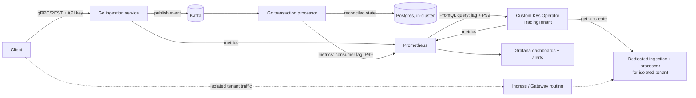

# Architecture

This is the high-level design for go-transaction-control-plane. It describes
the system as a whole: the problem it solves, the major components, and the
trade-offs behind them. It does not cover implementation detail; for
field-level specs and algorithms, see the linked [DESIGN docs](#related-docs).

## Problem statement

Demonstrate a distributed, real-time transaction processing engine that
exercises both financial-systems engineering (correctness, idempotency,
reconciliation under at-least-once delivery) and cloud-native platform
engineering (Kubernetes operators, tenant-aware autoscaling, observability),
deployed end-to-end on a local Kind cluster so the system can be inspected
running rather than just read as source.

## Goals

- A zero-allocation ingestion hot path for accepting mock high-throughput
  transaction events.
- Kafka-based event streaming decoupling ingestion from processing.
- Postgres-backed reconciliation of transaction state with ACID guarantees.
- A custom Kubernetes operator (`TradingTenant`) that scales and isolates
  tenants based on joint signals, not a single metric.
- Prometheus/Grafana observability with alerting, not just dashboards.
- A local Kind deployment a reviewer can reproduce end-to-end, plus
  documented results (throughput, P50/P99 latency) from a real load-test
  run against it — see the README's
  [Load test results](../README.md#load-test-results).

## Non-goals

- Not a real trading venue: all transaction data is mock/synthetic.
- Not optimized for HFT-grade (sub-microsecond) latency inside the database
  layer; the zero-allocation discipline applies to the ingestion hot path,
  not to Postgres write latency.
- Not multi-region. Single-region deployment; multi-region failover is out
  of scope.

## System diagram

## Data flow

1. A client sends a mock transaction event to the ingestion endpoint,
   authenticated with an API key/bearer token and subject to rate limiting.
2. The ingestion service validates the payload (malformed requests are
   rejected with 4xx, never silently dropped), then publishes it to Kafka
   through a circuit-breaker-guarded call. If Kafka can't keep up, the
   ingestion service applies backpressure (reject/shed load with a clear
   response) rather than buffering unboundedly or blocking the hot path.
   See [DESIGN-ingestion.md](DESIGN-ingestion.md) for the allocation
   strategy and breaker details.
3. The transaction processor consumes events from Kafka and applies
   P&L-style reconciliation logic idempotently (safe against Kafka's
   at-least-once delivery; duplicates must not double-count). Events that
   fail processing after bounded retries are routed to a dead-letter queue
   instead of blocking the consumer. See
   [DESIGN-processor.md](DESIGN-processor.md) for the reconciliation
   algorithm and the DLQ retry/routing mechanics.
4. Reconciled state is written to Postgres through a
   circuit-breaker-guarded storage layer, with connection pooling sized
   deliberately for the write/read concurrency this service expects.
5. The processor exports Kafka consumer lag and P99 latency per tenant as
   Prometheus gauges alongside its other metrics — it does not go through a
   separate lag exporter. In parallel, the custom `TradingTenant` operator
   queries Prometheus for these same two signals (plus partition count) on
   each reconcile pass and reconciles each `TradingTenant` resource:
   scaling replicas whenever there's still Kafka-side headroom to do so,
   falling back to isolating a tenant only once it's out of that headroom,
   or flagging a downstream bottleneck as `Degraded`, depending on which
   signals are elevated. Isolation now provisions a dedicated
   ingestion/processor pair for that tenant and routes its traffic there
   via an ingress/gateway rule, not just a spec flag (see
   [ADR 0007](decisions/0007-automated-tenant-isolation.md)). See
   [DESIGN-operator.md](DESIGN-operator.md) for the full decision table and
   the Prometheus query path.
6. All three services (ingestion, processor, operator) export Prometheus
   metrics on `/metrics`; Grafana dashboards and Alertmanager rules built on
   top of those metrics are checked into the repo as code.

## Major trade-offs

- **Postgres over Cassandra for the transaction ledger.** ACID guarantees
  and referential integrity come for free, which matters for financial
  correctness, at the cost of Cassandra's easier horizontal write scaling
  and per-service keyspace isolation. See
  [ADR 0001](decisions/0001-postgres-over-cassandra.md).
- **One custom operator, not several.** Only tenant-aware scaling/isolation
  logic (`TradingTenant`) is custom-built; Kafka (Strimzi), Postgres, TLS
  (cert-manager), and the metrics stack (kube-prometheus-stack) all run
  in-cluster via mature existing operators/charts instead of being
  reimplemented. Postgres started out as a managed AWS service (zero
  in-cluster operational surface) and later moved in-cluster alongside the
  rest of the stack — see [ADR 0002](decisions/0002-single-custom-operator.md)
  and its superseding [ADR 0006](decisions/0006-postgres-in-cluster.md) for
  why.
- **Kind over a public cloud deployment.** The project was originally scoped
  to include a self-hosted k3s-on-EC2 deployment with a public endpoint
  (trading the operational overhead of self-managing the control plane for
  lower cost than managed EKS/ECS). That's been dropped: a local Kind
  cluster exercises the identical Kubernetes surface — same CRDs, same
  operator, same Helm charts — end-to-end, without the ongoing cost and
  maintenance burden of a live public deployment for a portfolio project.
- **A long-running service over Lambda.** Deploying ingestion as a
  long-running service on the cluster avoids Lambda's cold-start tail
  latency on a hot ingestion path where P99 matters; the trade-off is paying
  for always-on compute instead of pay-per-invocation.

## Related docs

| Doc | Scope |
|---|---|
| [DESIGN-operator.md](DESIGN-operator.md) | `TradingTenant` CRD spec and reconcile decision logic |
| [DESIGN-ingestion.md](DESIGN-ingestion.md) | Ingestion hot-path allocation strategy, gRPC/REST transports, backpressure, circuit breaker |
| [DESIGN-ledger.md](DESIGN-ledger.md) | Ledger domain types and the fixed-point `int64` amount representation |
| [DESIGN-processor.md](DESIGN-processor.md) | Idempotent P&L reconciliation algorithm and the Kafka consumer's DLQ retry/routing mechanics |
| [decisions/](decisions/) | ADR log |
