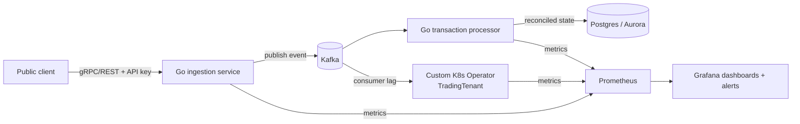

# Architecture

This is the high-level design for go-transaction-control-plane. It describes
the system as a whole: the problem it solves, the major components, and the
trade-offs behind them. It does not cover implementation detail; for
field-level specs and algorithms, see the linked [DESIGN docs](#related-docs).

## Problem statement

Demonstrate a distributed, real-time transaction processing engine that
exercises both financial-systems engineering (correctness, idempotency,
reconciliation under at-least-once delivery) and cloud-native platform
engineering (Kubernetes operators, tenant-aware autoscaling, observability),
deployed to a public sandbox so the system can be inspected end-to-end rather
than just read as source.

## Goals

- A zero-allocation ingestion hot path for accepting mock high-frequency
  transaction events.
- Kafka-based event streaming decoupling ingestion from processing.
- Postgres-backed reconciliation of transaction state with ACID guarantees.
- A custom Kubernetes operator (`TradingTenant`) that scales and isolates
  tenants based on joint signals, not a single metric.
- Prometheus/Grafana observability with alerting, not just dashboards.
- A public sandbox deployment that a reviewer can hit directly, plus a
  load-test script and documented results from a real run.

## Non-goals

- Not a real trading venue: all transaction data is mock/synthetic.
- Not optimized for HFT-grade (sub-microsecond) latency inside the database
  layer; the zero-allocation discipline applies to the ingestion hot path,
  not to Postgres write latency.
- Not multi-region. Single-region deployment; multi-region failover is out
  of scope.

## System diagram

## Data flow

1. A client sends a mock transaction event to the public ingestion endpoint,
   authenticated with an API key/bearer token and subject to rate limiting.
2. The ingestion service validates the payload (malformed requests are
   rejected with 4xx, never silently dropped), then publishes it to Kafka
   through a circuit-breaker-guarded call. If Kafka can't keep up, the
   ingestion service applies backpressure (reject/shed load with a clear
   response) rather than buffering unboundedly or blocking the hot path.
   See [DESIGN-ingestion.md](DESIGN-ingestion.md) for the allocation
   strategy and breaker details.
3. The transaction processor consumes events from Kafka and applies
   P&L-style reconciliation logic idempotently (safe against Kafka's
   at-least-once delivery; duplicates must not double-count). Events that
   fail processing after bounded retries are routed to a dead-letter queue
   instead of blocking the consumer.
4. Reconciled state is written to Postgres/Aurora through a
   circuit-breaker-guarded storage layer, with connection pooling sized
   deliberately for the write/read concurrency this service expects.
5. In parallel, the custom `TradingTenant` operator watches Kafka consumer
   lag and processor P99 latency per tenant and reconciles each
   `TradingTenant` resource: scaling replicas, isolating a tenant onto a
   dedicated node pool, or flagging a downstream bottleneck as `Degraded`,
   depending on which signals are elevated. See
   [DESIGN-operator.md](DESIGN-operator.md) for the full decision table.
6. All three services (ingestion, processor, operator) export Prometheus
   metrics on `/metrics`; Grafana dashboards and Alertmanager rules built on
   top of those metrics are checked into the repo as code.

## Major trade-offs

- **Postgres over Cassandra for the transaction ledger.** ACID guarantees
  and referential integrity come for free, which matters for financial
  correctness, at the cost of Cassandra's easier horizontal write scaling
  and per-service keyspace isolation. See
  [ADR 0001](decisions/0001-postgres-over-cassandra.md).
- **One custom operator, not several.** Only tenant-aware scaling/isolation
  logic (`TradingTenant`) is custom-built; Kafka (Strimzi), TLS
  (cert-manager), and the metrics stack (kube-prometheus-stack) all use
  mature existing operators instead of being reimplemented. See
  [ADR 0002](decisions/0002-single-custom-operator.md).
- **ECS/EKS with a public endpoint over Lambda.** A long-running service
  avoids Lambda's cold-start tail latency on a hot ingestion path where P99
  matters; the trade-off is paying for always-on compute instead of
  pay-per-invocation.

## Related docs

| Doc | Scope |
|---|---|
| [DESIGN-operator.md](DESIGN-operator.md) | `TradingTenant` CRD spec and reconcile decision logic |
| [DESIGN-ingestion.md](DESIGN-ingestion.md) | Ingestion hot-path allocation strategy, backpressure, circuit breaker |
| [decisions/](decisions/) | ADR log |
