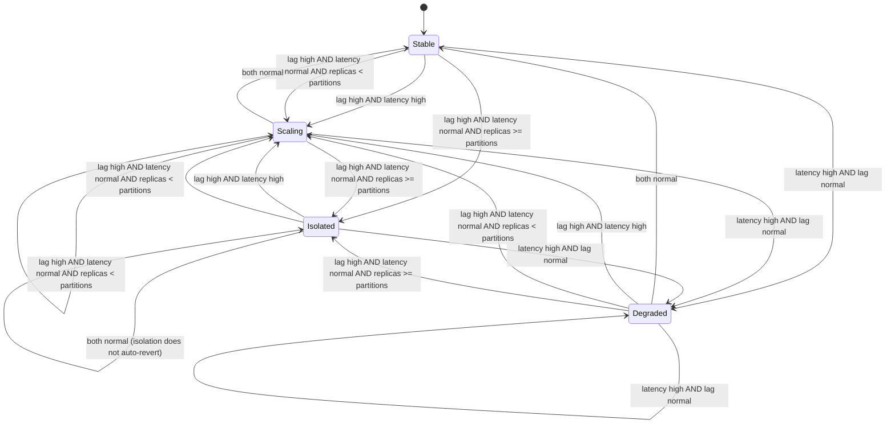

# Design: Kubernetes Operator (`/operator`)

This is the low-level design for the custom Kubernetes operator, covering
the `TradingTenant` CRD and its reconciler. For where this fits in the
overall system, see [ARCHITECTURE.md](ARCHITECTURE.md). For the trade-off of
building one custom operator instead of several, see
[ADR 0002](decisions/0002-single-custom-operator.md).

A `TradingTenant` represents one institutional trading client on the
platform. The reconciler evaluates two independent signals for each tenant:
Kafka consumer lag and processor P99 latency. It takes a different kind
of action depending on which are elevated, rather than reducing everything
to a single replica-count number.

## CRD field spec

### `spec`

| Field | Type | Constraints | Notes |
|---|---|---|---|
| `tenantID` | string | required, immutable after creation | Identifies the institutional client this resource represents. |
| `minReplicas` | int32 | required, `>= 1` | Lower bound for `currentReplicas`. |
| `maxReplicas` | int32 | required, `>= minReplicas` | Upper bound the scale-up branch must respect. |
| `resources.cpuRequest` | string (Kubernetes quantity, e.g. `"500m"`) | required | Per-pod CPU request. |
| `resources.memoryRequest` | string (Kubernetes quantity, e.g. `"512Mi"`) | required | Per-pod memory request. |
| `scaling.kafkaLagThreshold` | int64 | required, `> 0` | Consumer lag (messages) above which lag is considered "high" for this tenant. |
| `scaling.p99LatencyThresholdMs` | int32 | required, `> 0` | Processor P99 latency (ms) above which latency is considered "high" for this tenant. |
| `isolation.dedicatedNodePool` | bool | operator-set only; not user-editable | Set to `true` by the reconciler when the isolation branch fires. A user setting this at creation time has no effect: the operator is the sole writer for this field. Reset to `false` only through the same reconcile logic, never manually. |

### `status`

| Field | Type | Notes |
|---|---|---|
| `currentReplicas` | int32 | Last replica count set by the reconciler. |
| `state` | enum: `Stable` \| `Scaling` \| `Isolated` \| `Degraded` | See decision table below. |
| `observedKafkaLag` | int64 | Most recently observed consumer lag for this tenant's partitions. |
| `observedP99Ms` | int32 | Most recently observed processor P99 latency for this tenant. |
| `observedPartitionCount` | int32 | Partition count of this tenant's Kafka topic, most recently observed. Used against `currentReplicas` to determine whether there's still Kafka-side parallelism headroom before falling back to isolation. |
| `lastReconcileTime` | metav1.Time | Timestamp of the most recent reconcile pass, updated every pass regardless of whether action was taken. |

Status is updated via the status subresource only. Reconcile logic never
writes to `spec`: spec is user (or, for `isolation.dedicatedNodePool`,
operator-owned-but-still-spec) intent; the reconciler's job is to observe
and act, not to mutate the desired state it's reconciling against.

## Lag and latency observation path

`observedKafkaLag` and `observedP99Ms` are populated by querying
**Prometheus**, not by the reconciler calling the Kafka broker API directly.

- The processor already exports Kafka consumer lag (per tenant) and P99
  processing latency as Prometheus gauges/histograms on its own `/metrics`
  endpoint — it computes lag itself from its consumer group's current
  offset vs. the partition high-water mark, so no separate lag exporter
  (e.g. `kafka_exporter`, `kminion`) is needed for this signal.
- Prometheus scrapes that endpoint on its normal interval. `observedKafkaLag`
  and `observedP99Ms` are therefore only as fresh as the last scrape, not
  live at the moment of reconcile — a deliberate trade-off (see below).
- On each reconcile pass, the operator runs an instant PromQL query against
  Prometheus's HTTP API (via `prometheus/client_golang`'s `api`/`api/v1`
  client) scoped to the tenant, under the same bounded `context.Context`
  every other external call in `Reconcile` uses. The result populates
  `observedKafkaLag`, `observedP99Ms`, and `observedPartitionCount` in the
  status subresource for that pass.
- No separate component updates the CR's status. The reconciler that reads
  Prometheus is the same reconciler that classifies lag/latency, decides the
  action, and writes `status` — this keeps "observe" and "act" in one
  auditable pass rather than splitting them across a watcher and an actor.

This mirrors how KEDA's Prometheus scaler works (poll PromQL from inside the
controller each evaluation cycle) rather than routing through the
Kubernetes custom-metrics API (`prometheus-adapter` + the metrics API
aggregation layer): that path decouples the operator from Prometheus's
query API, but adds a whole extra component for a benefit this
single-purpose operator doesn't need. The trade-off accepted here is a
hard runtime dependency on Prometheus's scrape freshness for a value that
gates autoscaling decisions — if the scrape interval lags real Kafka lag by
tens of seconds, the operator acts on stale data for that long.

## Reconcile decision table

For each `TradingTenant`, the reconciler classifies `observedKafkaLag`
against `scaling.kafkaLagThreshold` and `observedP99Ms` against
`scaling.p99LatencyThresholdMs`, each as high/normal, then takes one of five
actions. The lag-high/latency-normal case is not a single branch: it splits
on whether the tenant still has unused Kafka-side parallelism
(`currentReplicas` vs `observedPartitionCount`), checked in order.

| Lag | Latency | Sub-case | Diagnosis | Action | Resulting `state` |
|---|---|---|---|---|---|
| High | High | — | Genuine under-capacity | Scale up `currentReplicas`, bounded by `maxReplicas` | `Scaling` |
| High | Normal | `currentReplicas < observedPartitionCount` | Backlog building but still Kafka-side headroom to add consumers | Scale up `currentReplicas` first, bounded by `maxReplicas` and `observedPartitionCount` | `Scaling` |
| High | Normal | `currentReplicas >= observedPartitionCount` | At partition parity already; noisy-neighbor / partition-skew, not a capacity problem | Set `isolation.dedicatedNodePool: true`; do not change replica count; reconciler provisions a dedicated ingestion/processor Deployment and routes the tenant to it (see [ADR 0007](decisions/0007-automated-tenant-isolation.md)) | `Isolated` |
| Normal | High | — | Likely a downstream (Postgres) bottleneck that more replicas won't fix | No scaling action; surface for investigation | `Degraded` |
| Normal | Normal | — | Healthy | No action | `Stable` |

Notes on the branches:

- The scale-up branch (both the high/high case and the headroom sub-case of
  high/normal) clamps at `maxReplicas`: if the tenant is already at
  `maxReplicas` and its signals still call for scaling, `state` stays
  `Scaling` but no further replica increase is attempted; this repo's
  initial cut treats "already at max" as a no-further-action case within
  the `Scaling` state rather than introducing a sixth state.
- The high/normal branch is checked against `observedPartitionCount` before
  isolation is considered: adding a replica beyond the tenant's partition
  count creates an idle consumer, not more throughput, since Kafka never
  assigns more than one consumer per partition within a group. So scaling
  is always attempted first while there's still partition headroom;
  isolation only fires once `currentReplicas >= observedPartitionCount`,
  i.e. once scaling genuinely can't help anymore.
- The isolation branch (the no-headroom sub-case) is one-directional in
  this initial design: once `dedicatedNodePool` is set `true`, the
  reconciler does not automatically revert it back to `false`, regardless
  of which sub-case triggered isolation or how many subsequent reconcile
  passes read a normal lag/latency pair. Reverting isolation is always a
  deliberate operational action, never automatic, to avoid flapping a
  tenant on and off a dedicated node pool whose metrics sit near the
  threshold.
- The `Degraded` branch never scales: adding processor replicas doesn't
  fix a bottleneck downstream of the processor (e.g. Postgres write
  contention), so scaling would just add load without addressing the cause.

### Default posture: shared pool is the default, isolation is the exception

Most tenants run in the shared pool under normal Kubernetes resource
requests/limits (`spec.resources`) and never trigger the isolation branch.
`isolation.dedicatedNodePool` escalation is reserved for tenants whose
signals specifically indicate a noisy-neighbor pattern. This mirrors how
real multi-tenant trading platforms tier clients (shared infrastructure by
default, dedicated capacity as a paid/escalated tier) rather than isolating
every tenant by default, which would erase the cost benefit of
multi-tenancy entirely.

## State diagram

This diagram and the decision table above describe the same five
transitions (the lag-high/latency-normal case splits into a scale-up and
an isolate transition depending on partition headroom); any future change
to one must be reflected in the other.

## Idempotency and reconcile safety

- `Reconcile` must produce the same end state given the same observed
  inputs (`observedKafkaLag`, `observedP99Ms`, current spec), regardless of
  how many times or how close together it's called. Kubernetes controllers
  do not guarantee reconcile is called exactly once per change, so this is
  a hard requirement, not an optimization.
- Every external call the reconciler makes (reading metrics for lag/P99,
  updating the status subresource, patching node pool assignment) runs
  under a bounded `context.Context`: no reconcile pass blocks indefinitely
  on a dependency.
- Status subresource updates and spec reads are kept as separate concerns:
  the reconciler reads `spec` to know thresholds/bounds, reads external
  metrics to classify lag/latency, and writes only `status` (plus, in the
  isolation branch, the single operator-owned `spec.isolation.dedicatedNodePool`
  field); it never rewrites `minReplicas`, `maxReplicas`, or the threshold
  fields a user set.
- Errors returned from `Reconcile` are returned to the controller-runtime
  caller for standard requeue/backoff handling: the reconciler never
  sleeps-and-retries internally.

## Dedicated pool provisioning and event emission

When the isolation branch fires, the reconciler does more than set the
spec flag: it get-or-creates a dedicated ingestion + processor Deployment
(with `nodeSelector`/`tolerations` for an isolated node pool), a Service
scoped to that Deployment's pods, and a ConfigMap carrying the tenant's
reserved Kafka partition set, which the dedicated processor consumes via
manual partition assignment rather than consumer-group subscription. Every
side effect here follows the same get-or-create idempotency pattern as the
rest of `Reconcile`. State transitions (`TenantIsolated`,
`DedicatedPoolCreated`, etc.) emit `record.EventRecorder` Kubernetes Events
and increment a low-cardinality
`tradingtenant_isolation_transitions_total{state=...}` counter. Full
rationale, the partition reservation scheme, and the ingress-routing
prerequisite are in [ADR 0007](decisions/0007-automated-tenant-isolation.md).

## De-isolation and dedicated resource teardown

`isolation.dedicatedNodePool` never auto-reverts (see above), so reverting
it back to `false` is always a deliberate, manual operational action —
typically `kubectl patch` or `kubectl edit` against the `TradingTenant`'s
spec. That manual revert is not itself a Kubernetes garbage-collection
trigger: the dedicated Deployment/Service/ConfigMap are owned by the
`TradingTenant` (via `ownerReferences`), so they're only GC'd if the
`TradingTenant` object itself is deleted, not on a spec field change. The
reconciler therefore treats a `false` value as an explicit teardown signal
on every pass: it get-or-deletes the same four dedicated resources
`ensureDedicatedPool` get-or-creates, so a tenant reverted out of isolation
doesn't leave orphaned Deployments/Services/ConfigMaps running (and
billing) on the dedicated node pool indefinitely. Teardown is idempotent
the same way provisioning is — deleting an already-absent resource is a
no-op, not an error — and only emits the `DedicatedPoolTornDown` event and
counter increment the first pass that actually deletes something, mirroring
`DedicatedPoolProvisioned`'s create-only signal.

## Testing approach

Tests use `controller-runtime`'s fake client with one case per decision
table branch (five minimum: scale-up on lag+latency high, scale-up on
lag-high/latency-normal with partition headroom, isolate on
lag-high/latency-normal at partition parity, degraded, stable), plus an
explicit idempotency test that calls `Reconcile` twice against the same
object state and asserts the resulting `status` is identical on both
passes.

## Why not HPA/KEDA

`HorizontalPodAutoscaler` and KEDA both work by computing a target replica
count independently per metric and then taking the max (or a configured
combination) across metrics: the output is always a single number, "scale
to N replicas." That collapses exactly the distinction this operator is
built to make: high lag with normal latency and high lag with high latency
look identical to a metric-max autoscaler (both say "lag is high, scale
up"), but they call for different actions: capacity increase in one case,
noisy-neighbor isolation in the other. `TradingTenant`'s reconciler makes a
joint decision across both signals and can select between three different
action types (scale, isolate, flag degraded), not just a replica count,
which is the reason this is a custom controller rather than an HPA/KEDA
`ScaledObject` configuration.
