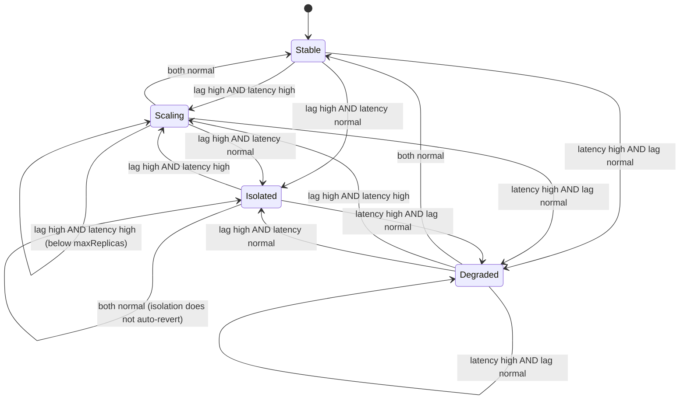

# Design: Kubernetes Operator (`/operator`)

This is the low-level design for the custom Kubernetes operator, covering
the `TradingTenant` CRD and its reconciler. For where this fits in the
overall system, see [ARCHITECTURE.md](ARCHITECTURE.md). For the trade-off of
building one custom operator instead of several, see
[ADR 0002](decisions/0002-single-custom-operator.md).

A `TradingTenant` represents one institutional trading client on the
platform. The reconciler evaluates two independent signals for each tenant:
Kafka consumer lag and processor P99 latency. It takes a different kind
of action depending on which are elevated, rather than reducing everything
to a single replica-count number.

## CRD field spec

### `spec`

| Field | Type | Constraints | Notes |
|---|---|---|---|
| `tenantID` | string | required, immutable after creation | Identifies the institutional client this resource represents. |
| `minReplicas` | int32 | required, `>= 1` | Lower bound for `currentReplicas`. |
| `maxReplicas` | int32 | required, `>= minReplicas` | Upper bound the scale-up branch must respect. |
| `resources.cpuRequest` | string (Kubernetes quantity, e.g. `"500m"`) | required | Per-pod CPU request. |
| `resources.memoryRequest` | string (Kubernetes quantity, e.g. `"512Mi"`) | required | Per-pod memory request. |
| `scaling.kafkaLagThreshold` | int64 | required, `> 0` | Consumer lag (messages) above which lag is considered "high" for this tenant. |
| `scaling.p99LatencyThresholdMs` | int32 | required, `> 0` | Processor P99 latency (ms) above which latency is considered "high" for this tenant. |
| `isolation.dedicatedNodePool` | bool | operator-set only; not user-editable | Set to `true` by the reconciler when the isolation branch fires. A user setting this at creation time has no effect: the operator is the sole writer for this field. Reset to `false` only through the same reconcile logic, never manually. |

### `status`

| Field | Type | Notes |
|---|---|---|
| `currentReplicas` | int32 | Last replica count set by the reconciler. |
| `state` | enum: `Stable` \| `Scaling` \| `Isolated` \| `Degraded` | See decision table below. |
| `observedKafkaLag` | int64 | Most recently observed consumer lag for this tenant's partitions. |
| `observedP99Ms` | int32 | Most recently observed processor P99 latency for this tenant. |
| `lastReconcileTime` | metav1.Time | Timestamp of the most recent reconcile pass, updated every pass regardless of whether action was taken. |

Status is updated via the status subresource only. Reconcile logic never
writes to `spec`: spec is user (or, for `isolation.dedicatedNodePool`,
operator-owned-but-still-spec) intent; the reconciler's job is to observe
and act, not to mutate the desired state it's reconciling against.

## Reconcile decision table

For each `TradingTenant`, the reconciler classifies `observedKafkaLag`
against `scaling.kafkaLagThreshold` and `observedP99Ms` against
`scaling.p99LatencyThresholdMs`, each as high/normal, then takes one of four
actions:

| Lag | Latency | Diagnosis | Action | Resulting `state` |
|---|---|---|---|---|
| High | High | Genuine under-capacity | Scale up `currentReplicas`, bounded by `maxReplicas` | `Scaling` |
| High | Normal | Noisy-neighbor / partition-skew (not a capacity problem) | Set `isolation.dedicatedNodePool: true`; do not change replica count | `Isolated` |
| Normal | High | Likely a downstream (Postgres) bottleneck that more replicas won't fix | No scaling action; surface for investigation | `Degraded` |
| Normal | Normal | Healthy | No action | `Stable` |

Notes on the branches:

- The scale-up branch clamps at `maxReplicas`: if the tenant is already at
  `maxReplicas` and lag/latency are both still high, `state` stays
  `Scaling` (or could be considered `Degraded` in a future revision) but no
  further replica increase is attempted; this repo's initial cut treats
  "already at max" as a no-further-action case within the `Scaling` state
  rather than introducing a fifth state.
- The isolation branch is one-directional in this initial design: once
  `dedicatedNodePool` is set `true`, the reconciler does not automatically
  revert it back to `false` on a single normal reading, to avoid flapping a
  tenant on and off a dedicated node pool. Reverting isolation is a
  deliberate operational action, not an automatic one.
- The `Degraded` branch never scales: adding processor replicas doesn't
  fix a bottleneck downstream of the processor (e.g. Postgres write
  contention), so scaling would just add load without addressing the cause.

### Default posture: shared pool is the default, isolation is the exception

Most tenants run in the shared pool under normal Kubernetes resource
requests/limits (`spec.resources`) and never trigger the isolation branch.
`isolation.dedicatedNodePool` escalation is reserved for tenants whose
signals specifically indicate a noisy-neighbor pattern. This mirrors how
real multi-tenant trading platforms tier clients (shared infrastructure by
default, dedicated capacity as a paid/escalated tier) rather than isolating
every tenant by default, which would erase the cost benefit of
multi-tenancy entirely.

## State diagram

This diagram and the decision table above describe the same four
transitions; any future change to one must be reflected in the other.

## Idempotency and reconcile safety

- `Reconcile` must produce the same end state given the same observed
  inputs (`observedKafkaLag`, `observedP99Ms`, current spec), regardless of
  how many times or how close together it's called. Kubernetes controllers
  do not guarantee reconcile is called exactly once per change, so this is
  a hard requirement, not an optimization.
- Every external call the reconciler makes (reading metrics for lag/P99,
  updating the status subresource, patching node pool assignment) runs
  under a bounded `context.Context`: no reconcile pass blocks indefinitely
  on a dependency.
- Status subresource updates and spec reads are kept as separate concerns:
  the reconciler reads `spec` to know thresholds/bounds, reads external
  metrics to classify lag/latency, and writes only `status` (plus, in the
  isolation branch, the single operator-owned `spec.isolation.dedicatedNodePool`
  field); it never rewrites `minReplicas`, `maxReplicas`, or the threshold
  fields a user set.
- Errors returned from `Reconcile` are returned to the controller-runtime
  caller for standard requeue/backoff handling: the reconciler never
  sleeps-and-retries internally.

## Testing approach

Tests use `controller-runtime`'s fake client with one case per decision
table branch (four minimum: scale-up, isolate, degraded, stable), plus an
explicit idempotency test that calls `Reconcile` twice against the same
object state and asserts the resulting `status` is identical on both
passes.

## Why not HPA/KEDA

`HorizontalPodAutoscaler` and KEDA both work by computing a target replica
count independently per metric and then taking the max (or a configured
combination) across metrics: the output is always a single number, "scale
to N replicas." That collapses exactly the distinction this operator is
built to make: high lag with normal latency and high lag with high latency
look identical to a metric-max autoscaler (both say "lag is high, scale
up"), but they call for different actions: capacity increase in one case,
noisy-neighbor isolation in the other. `TradingTenant`'s reconciler makes a
joint decision across both signals and can select between three different
action types (scale, isolate, flag degraded), not just a replica count,
which is the reason this is a custom controller rather than an HPA/KEDA
`ScaledObject` configuration.
