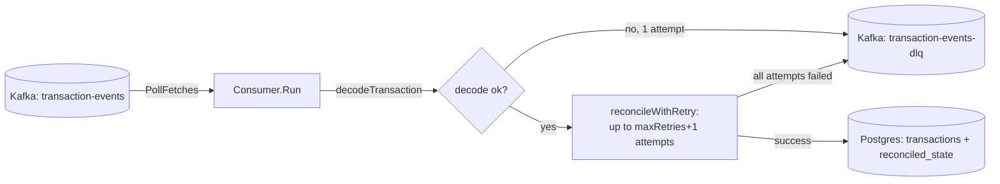
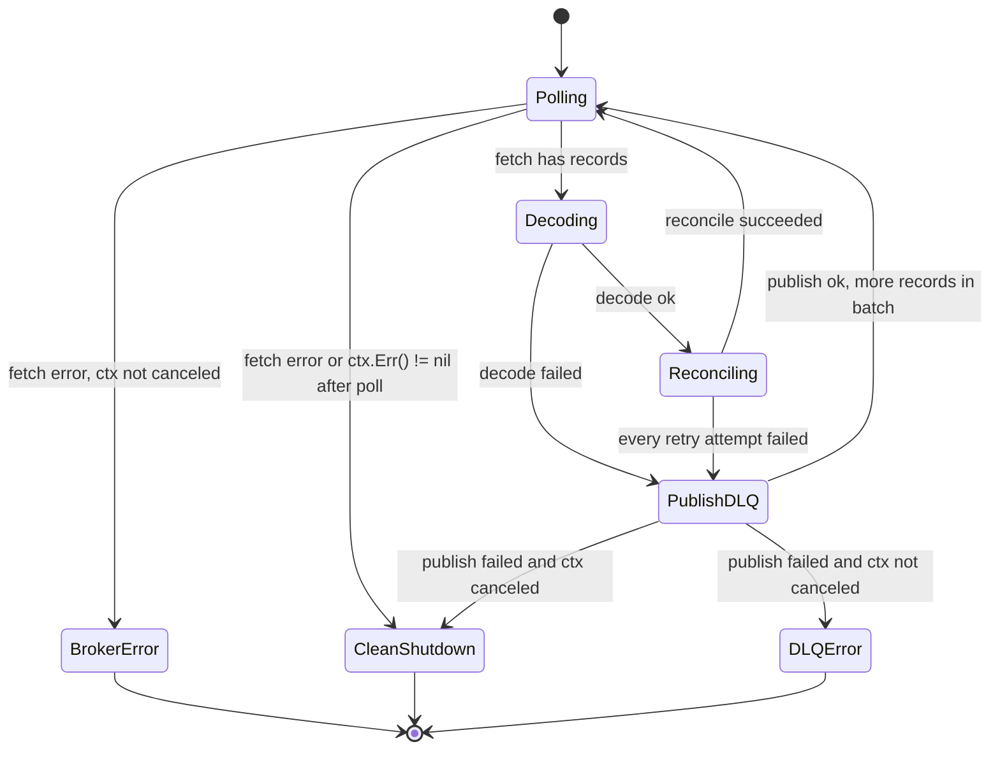

# Design: Transaction Processor (`/internal/processor`, `/internal/processor/kafka`)

This is the low-level design for the transaction processor: the service
that consumes transaction events from Kafka, applies idempotent P&L
reconciliation with bounded retries, and routes a record to a dead-letter
topic only once it either fails to decode or exhausts those reconciliation
retries. For where this fits in the overall system, see
[ARCHITECTURE.md](ARCHITECTURE.md). For the `Transaction`/`ReconciledState`
domain types and the fixed-point amount representation referenced
throughout this doc, see [DESIGN-ledger.md](DESIGN-ledger.md).

`internal/processor` defines `Reconciler`, the reconciliation logic itself,
depending only on the repository interfaces in `internal/ledger`.
`internal/processor/kafka` is the transport adapter: it owns the Kafka
consumer loop, record decoding, and DLQ routing, and depends on
`internal/processor` only through the narrow `reconciler` interface it
declares locally (`Reconcile(ctx, ledger.Transaction) error`), not on the
concrete `*processor.Reconciler` type.

## Pipeline position

Reconciliation is always attempted first for a decodable record; a record
only reaches the DLQ topic if it never decodes at all, or if every
reconciliation attempt in `reconcileWithRetry`'s bounded budget fails. A
record's payload is the same `wireEvent` JSON shape
`internal/ingestion/kafka` publishes (`event_id`, `tenant_id`,
`schema_version`, `instrument`, `side`, `quantity`, `price`, `currency`,
`occurred_at`), decoded by `decodeTransaction` into a `ledger.Transaction`.
Amount fields (`quantity`, `price`) arrive as decimal strings and are
parsed with `ledger.ParseAmount` into the fixed-point `int64`
representation described in DESIGN-ledger.md.

## Idempotent P&L reconciliation (`processor.Reconciler`)

Kafka guarantees at-least-once delivery: a broker restart, a consumer-group
rebalance, or a redelivered offset can hand `Reconciler.Reconcile` the same
transaction more than once. `Reconcile` is written so a redelivery never
double-applies its effect, without taking any lock of its own:

1. **Insert the transaction, tolerating a duplicate.** `Reconcile` calls
   `Transactions.Insert(ctx, txn)`. If that fails with
   `ledger.ErrDuplicateEvent` (the storage layer enforces uniqueness on
   `EventID`), it falls back to `Transactions.GetByEventID` to fetch the
   row a prior delivery already inserted, rather than treating the
   duplicate as an error.
2. **Load the current reconciled state**, defaulting to a zero
   `ReconciledState` (`ErrNotFound` from `States.Get`) if this is the
   tenant/instrument's first transaction.
3. **Check the watermark.** If `state.LastTransactionID` is already `>=`
   the inserted transaction's `ID`, `Reconcile` returns `nil` immediately.
   This is the redelivery short-circuit: a prior call already folded this
   transaction (or a later one) into state, so there's nothing left to do.
4. **Apply the transaction** (`applyTransaction`) under weighted-average-
   cost accounting, and advance `state.LastTransactionID` to the
   transaction's `ID`.
5. **Upsert the new state.** If `States.Upsert` fails with
   `ledger.ErrStaleReconciledState`, `Reconcile` returns `nil` rather than
   an error: it lost a compare-and-swap to a concurrent apply that already
   advanced the watermark past this transaction (e.g. a brief overlap
   during a consumer-group rebalance where two processor replicas
   momentarily both own the same partition), so the state already reflects
   this transaction's effect one way or another.

This scheme depends on every transaction for a given `(tenant, instrument)`
being delivered to a single `Reconcile` caller **in order**. That ordering
guarantee comes from upstream: `internal/ingestion/kafka` keys records by
`<tenant_id>:<instrument>`, so Kafka partitioning puts every event for one
tenant's instrument on the same partition, observed by one consumer at a
time. `Reconcile` does not re-derive or verify that ordering itself; it
relies on it and does no additional locking across concurrent callers for
the same instrument.

### Weighted-average-cost accounting (`applyTrade`)

`applyTrade` folds a trade of `signedQuantity` (positive for a buy,
negative for a sell) at `price` into `state`:

| Case | Behavior |
|---|---|
| No existing position, or trade extends it (same sign) | `AverageCost` becomes the weighted average of the existing cost basis and the new trade's cost: `(position*averageCost + signedQuantity*price) / (position+signedQuantity)`. |
| Trade opposes the existing position, partially closes it | Realizes P&L on `min(\|signedQuantity\|, \|position\|)` units at `(price - averageCost)` per unit for a long, or `(averageCost - price)` per unit for a short. `AverageCost` is unchanged for the remaining position. |
| Trade opposes and exceeds the existing position | Closes the existing position (realizing P&L as above) and flips to a fresh position on the other side, with `AverageCost` reset to `price` for the flipped remainder rather than blended with the closed position's now-irrelevant cost basis. |
| Trade exactly closes the existing position | Realizes P&L as above; `Position` and `AverageCost` both reset to zero. |

Amount arithmetic (`ledger.MulAmount`, `ledger.DivAmount`) operates on the
fixed-point `int64` representation and can return an error (e.g. overflow);
`applyTrade` propagates that as a wrapped error rather than silently
truncating.

## DLQ mechanism (`processor/kafka`)

### Config

| Field | Env var | Default (`LocalConfig`) | Notes |
|---|---|---|---|
| `Brokers` | `KAFKA_BROKERS` (comma-separated) | `localhost:9092` | Seed broker list for cluster metadata. |
| `Topic` | `KAFKA_TOPIC` | `transaction-events` | Topic consumed; matches ingestion's publish topic. |
| `GroupID` | `KAFKA_CONSUMER_GROUP` | `processor` | Consumer group, so processor replicas share the topic's partitions. |
| `DLQTopic` | `KAFKA_DLQ_TOPIC` | `transaction-events-dlq` | Where a record is published once it fails to decode or exhausts `MaxRetries` during reconciliation. |
| `MaxRetries` | `KAFKA_MAX_RETRIES` | `3` | Additional reconciliation attempts allowed after the first failure, before a record is routed to `DLQTopic`. Must be `>= 0`; `0` means a single attempt with no retry. |

`ConfigFromEnv` resolves these on top of `LocalConfig`'s defaults and calls
`validate()`, returning `ErrInvalidConfig` (wrapped with which check
failed) for a blank broker/topic/group/DLQ-topic entry, a negative
`MaxRetries`, or a non-integer `KAFKA_MAX_RETRIES`.

### Retry loop (`reconcileWithRetry`)

`reconcileWithRetry` calls `Reconcile` up to `maxRetries+1` times, stopping
at the first success, and only returns control to `Run` for DLQ routing
once every one of those attempts has failed. It returns the number of
attempts made plus the last error (`nil` on success). Retries run
back-to-back with no delay: per the doc comment on `reconcileWithRetry`,
reconciliation failures on this workload are expected to be transient
contention (e.g. a brief lock conflict or connection blip on the Postgres
write path), not a sustained outage, so a backoff would only slow down
recovery without improving it. The loop also exits early if `ctx` has been
canceled between attempts, rather than burning through the remaining retry
budget during shutdown.

### `dlqEvent` wire shape

A record reaches `DLQTopic` only after the above: either it failed to
decode, or its reconciliation exhausted `MaxRetries`. It is published as a
`dlqEvent`:

| Field | Type | Source |
|---|---|---|
| `original_topic` | `string` | The source record's `Topic`. |
| `original_partition` | `int32` | The source record's `Partition`. |
| `original_offset` | `int64` | The source record's `Offset`. |
| `payload` | `string` | The source record's raw `Value`, unmodified. |
| `failure_reason` | `string` | `failureErr.Error()`: the decode error, or the last reconcile error. |
| `attempts` | `int` | `1` for a decode failure (never retried); `maxRetries+1` for an exhausted reconcile. |
| `failed_at` | `string` | `time.Now().UTC()`, RFC3339Nano. |

This preserves enough context to locate the original record (topic,
partition, offset) and its unmodified payload for replay, plus enough
failure context (reason, attempt count, timestamp) to diagnose why it
failed without needing to cross-reference processor logs.

The DLQ record reuses the original record's `Key` (`dlqRecord := &kgo.Record{Topic: con.dlqTopic, Key: record.Key, Value: payload}`)
rather than generating a new one. Since ingestion keys records by
`<tenant_id>:<instrument>`, this means DLQ records stay groupable by
tenant/instrument on their new topic too, so downstream tooling (or a
human triaging the DLQ) can still filter by tenant without parsing the
JSON body first.

### One Kafka client, two roles

`kafkaClient` (the interface `Consumer` depends on) covers both
`PollFetches` and `ProduceSync`, and `NewConsumer` constructs exactly one
`*kgo.Client`. The consumer reuses that single connection to publish to the
DLQ topic rather than opening a second client dedicated to producing. A
second client would need its own broker connections, its own
`ClientID`, and its own lifecycle to manage alongside the consumer's,
for no benefit: `ProduceSync` on the existing client is a synchronous,
one-off call per failed record, not a high-throughput producer path that
would need independent tuning (batching, linger, acks) from the consumer
side. Keeping it to one client also means `Consumer.Close()` has a single
connection to tear down.

## `Consumer.Run`: failure and shutdown semantics

`Run` polls in a loop until `ctx` is canceled. Each fetch's records are
processed via `fetches.EachRecord`, calling `decodeTransaction` first and,
only on a successful decode, `reconcileWithRetry`:

- **No head-of-line blocking.** A single record's DLQ routing (decode
  failure or exhausted reconcile) does not abort the fetch batch: `Run`
  logs it, publishes it to the DLQ topic, and moves on to the next record
  via `EachRecord`'s callback. A batch of failing records for one
  tenant/instrument does not block other tenants' records in the same
  batch, or later fetches, from being processed.
- **A DLQ publish failure does abort `Run`** (returned as a wrapped
  error, per `TestConsumerRunAbortsWhenDLQPublishFails`), unlike a
  reconcile failure. A record that couldn't even reach the DLQ can't be
  silently dropped, so `Run` stops rather than continuing to consume past
  a record whose failure was never durably recorded anywhere.
- **A broker fetch error also aborts `Run`**, wrapped with the topic and
  partition it came from, unless `ctx` is already canceled, in which case
  it's treated as a clean shutdown (`nil` return) instead.
- **Shutdown races with an in-flight DLQ publish are treated as clean
  shutdown, not a fault.** `ctx` is only checked between fetch batches, not
  per record, so a record's retry loop or DLQ publish can still be running
  when `ctx` is canceled. When that happens, `ProduceSync` fails because
  the context it was given is already done, not because the broker
  rejected the write. `Run` checks `ctx.Err()` after a DLQ-publish failure
  and returns `nil` if it's non-nil, rather than surfacing what is really
  just a symptom of shutdown as a genuine error
  (`TestConsumerRunStopsCleanlyWhenCtxCanceledDuringDLQRoute` covers this
  race directly, using a reconciler test double that cancels `ctx` as a
  side effect of the first `Reconcile` call).
- **An empty fetch (no records, no error) is not treated as shutdown or a
  fault.** `Run` just polls again (`TestConsumerRunMultipleFetchesIncludingEmpty`).

## Why not X

- **Why no backoff/jitter between retries?** See "Retry loop" above:
  reconciliation failures here are expected to be transient contention on
  the Postgres write path, and a fixed retry budget with no delay recovers
  faster than a backoff would, at the cost of potentially adding load to
  an already-struggling dependency during a real outage. `MaxRetries`
  bounds that cost; there's no adaptive behavior (e.g. widening the
  backoff, or opening a circuit breaker) beyond that fixed bound today.
- **Why decode failures skip the retry loop entirely (`attempts` always
  `1`)?** A payload that fails `json.Unmarshal`, a bad UUID, or an
  unparseable amount/timestamp is a structurally invalid record: retrying
  the same bytes against the same decoder will fail identically every
  time, so `Run` routes it to the DLQ on the first attempt instead of
  spending `maxRetries` cycles re-parsing the same malformed payload.
- **Why does an aborted `Run` (broker error or DLQ publish failure) not
  attempt to resume from where it left off?** `Run`'s caller is expected to
  restart the consumer (a new `Consumer`/process), which resumes from the
  consumer group's last committed offset; `Run` itself has no retry-the-
  whole-loop logic, consistent with the guardrail against manual
  sleep/retry loops replacing the controller-level (here, orchestration-
  level) restart mechanism.

## Known limitations

- No tooling in this repo to consume from or replay `transaction-events-dlq`
  back into the main topic; `dlqEvent`'s `payload` and original
  topic/partition/offset are captured so that a replay tool could be built
  against them, but reprocessing today is a manual, out-of-repo exercise.
- `MaxRetries` and the no-backoff retry loop are process-local: if every
  processor replica independently exhausts retries against the same
  overloaded Postgres instance at roughly the same time, there's no
  cross-replica coordination (e.g. a shared circuit breaker) to reduce load
  before each replica's `MaxRetries` budget is spent.
